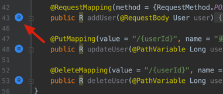

<a href="https://plugins.jetbrains.com/plugin/14723-restkit"></a>

## a powerful toolkit for restful services development.

[简体中文](./README.zh_CN.md) | [Gitee](https://gitee.com/newhoo/RESTKit) | [Yuque(语雀)](https://www.yuque.com/newhoo/restkit)

This plugin is committed to enhancing development efficiency with useful features. From the initial RestfulToolkit and joined common functions of Postman, rich and complete features can greatly improve the efficiency of IDEA development. Free to share with everyone, not for commercial purposes. If you find any problems, please give me feedback.

If this plugin helps, please **🌟 Star** and [Rating](https://plugins.jetbrains.com/plugin/14723-restkit/reviews)! If you have any good idea, please let me know.


## Features
- More supported jetbrains ides.
- Restful service automatic scanning and display.
  - Support searching service in native Search Everywhere. ( use: <kbd>Ctrl \\</kbd> or <kbd>Ctrl Alt N</kbd> )
  - Show restful service structure in tool window.
  - Service and Method jump to each other.
- Powerful request client：
  - Custom parameter format, support placeholder variable, formatted JSON.
  - Environment variable：define/manage/use/export/import, support preset function and script function.
  - Global header：can use with Environment, also support preset function and script function.
  - Parameter library：support display/save/delete in Headers/Params/Body tab.
  - Multi-protocol: supported multiple protocol.
  - Request script：support pre-request and post-script script.
  - Request info display: such as HTTP packet.
- Request log：save multi-protocol request log such as HTTP packet format.
- Plugin extension：through this, you can scan restful service in other framework.
- Language & Framework：
  - Support api local store by default.
  - Support Spring MVC / SpringBoot with java and kotlin in idea by default.


## Ecology
- Local Store: supported by default. Support store api to local file.
- Spring MVC: supported by default. Support Java and Kotlin implement.
- Jax-Rs: supported by plugin. See [RESTKit-JAX-RS](https://github.com/newhoo/RESTKit-JAX-RS)
- Dubbo: supported by plugin. See [RESTKit-Dubbo](https://github.com/newhoo/RESTKit-Dubbo). Support scanning and sending request.
- Redis: supported by plugin. See [RESTKit-Redis](https://github.com/newhoo/RESTKit-Redis). Support store api to redis and sending simple redis command.
- grpc: todo. Plan to realize by plugin.


## Install
- **Using IDE plugin system**

Recommended <kbd>Preferences(Settings)</kbd> > <kbd>Plugins</kbd> > <kbd>Browse repositories...</kbd> > <kbd>find "RESTKit"</kbd> > <kbd>Install Plugin</kbd>

- **Local Install**

Download plugin form <kbd>distributions/RESTKit-x.x.x.zip</kbd>, then <kbd>Preferences(Settings)</kbd> > <kbd>Plugins</kbd> > <kbd>Install Plugin from Disk...</kbd>

## Usage

### RESTKit Tool Window
Open project, find and open RESTKit at right window. RESTKit is composed of four parts: **toolbar**、**service tree**、**request client**.


#### Toolbar
- Refresh: refresh service list when updated.
- Search: search service in search everywhere.
- Filter: filter by HTTP method.
- Scan library: whether scan with library.
- Expand All.
- Collapse All.
- Setting：open setting view.
- View document.


#### Service Tree
- Display services by module.
- Navigate to source when double-clicking in the service list.
- Show context menu when right clicking.


#### HTTP Client
- Environment: select the environment variable that has been added. preview current environment when hovering.
- Method: http method, needn't select manually.
- URL: http uri, needn't input manually. support placeholder.
- Send: send request one time after clicking.
- Config: request config, provided by request client. The first one is `protocol: specific protocol`, and do not delete it!
- Headers tab: request header, needn't input manually. support placeholder and parameter library.
- Params tab: include query/path/form parameter, needn't input manually. support placeholder and parameter library.
- Body tab: body for POST/PUT/PATCH/DELETE, needn't input manually.
- Response tab: display response result. The content may be normal return, exception, or script return by the request script.
- Info tab: display request with http packet format.


### Search URL
- Search everywhere: <kbd>Double Shift</kbd> or click **search icon**。
  - When selecting item in search everywhere(URL tab), clicking <kbd>Option</kbd> or <kbd>Alt</kbd> helps to jump to service tree item.
  - Enable show this module name in configuration.
- Service tree: support input search when focus on service tree.


### Common Setting
Provide some common settings for the plugin.


#### Where: 
- <kbd>Preferences(Settings)</kbd> > <kbd>Other Settings</kbd> > <kbd>RESTKit</kbd>
- <kbd>RESTKit tool window</kbd> > <kbd>toolbar</kbd> > <kbd>setting</kbd> > <kbd>Common Setting</kbd>

#### Supported Web Framework
support Spring MVC and enabled by default. If you need support other framework restful apis, please see [RESTKit Extension](#Plugin Extension)

#### UI Config
- Show module name in search everywhere
- Display api group using file name(using module by default)
- Display api list using description(using url by default)
- Enable parameter library: default enabled. Need reopen current project after setting.

#### Request Config
- Enable request log: default disabled. Log path `$PROJECT_DIR$/.idea/restkit/logs/*.log`.
- Timeout: set request timeout. Never timeout when the value less than or equal 0.
- Script config: set pre-request and post-request script path. If path is empty, you can double click `Label` before the input box to generate script like `$PROJECT_DIR$/.idea/restkit/xxx-request Script.js`.


#### Other Config
- Local store path: api local storage file path.

### Environment Variable
- Environment variables indicate multi-set variables in advance, including `Literal Variable`, `Direct reference variable`, `Built-in function variable` and `Script variable`.
- Can be used for Config, URL, Headers, Params, request script and etc.
- Using placeholder to reference environment variables.
- Each project has isolated config(project level).
- Support import and export.


#### Setting
- <kbd>Preferences(Settings)</kbd> > <kbd>Other Settings</kbd> > <kbd>RESTKit</kbd> > <kbd>Environment</kbd>
- <kbd>RESTKit tool window</kbd> > <kbd>toolbar</kbd> > <kbd>setting</kbd> > <kbd>Environment Setting</kbd>

#### Add
1. Click <kbd>Add</kbd> button, input unique and brief name such as `DEV`, `FAT`, `UAT`, `PRE`, `PRO`.
2. Add/delete/move key-values in current env group, be enabled when selected checkbox.
3. When create a env group, it will create a default key-value `baseUrl: http://localhost:8080` used for replacing `{{baseUrl}}` in Config tab for http api.
4. **VALUE** is string type, can use `Built-in function variable` and `Script variable`. See below for more.


#### Copy
Copy a new environment group from current. Click <kbd>Copy</kbd> button, input unique and brief name.

#### Delete
Delete current environment group and content. Click <kbd>Delete</kbd> button.

#### Export & Import
1. Click <kbd>Export</kbd> button to export environment variables, environment script, global headers to clipboard as JSON format.
2. Click <kbd>Import</kbd> button to import environment config from clipboard in another project. Imported environments will replace all current content.
3. See `Event Log` tips when exception occurred.

#### KEY-VALUE Rules
KEY and VALUE are strings. VALUE supports reference variable such as:
- Direct reference variable: reference to key-value of current group using `{{KEY}}`.
- Built-in function variable: using `{{$functionName}}`. The default supplied variables are
  - `{{$timestamp}}`: current timestamp, ms.
  - `{{$uuid}}`: generate UUID randomly.
- Script variable: click <kbd>Script Variable</kbd> button and edit content in dialog. Using `{{$methodName$}}`. Only Java language is supported, see rules in the comment, no third-party library supported.

```java
public class RestKitScript {

    /**
     * Your script method, no param, method name must from {{$methodName$}}.
     * Use pre-request script can be more powerful.
     *
     * @return return value should be String
     */
    public static String methodName() {
        return "";
    }

}
```

#### Global Request Header

Configure request headers that add to the request by default in current project.


### API Local Store
- API Local Store used for manually saving API, an interface independently scanned. It's displayed as custom modules in Service Tree.
- Every api should have unique key composed of url and method.
- Enable by default. Disable in the setting.
- Support synchronization in different IDE/project when setting same file path.

#### Display


#### Add/Update
Click【Save Api】at any editor's right menu in the request client. There will be a tip when api existed.


- Protocol: supported request protocol, such as http, dubbo.
- Storage: where to store the api, can be extensible.
- Group: group name.
- Description: just brevity.
- Existed: the api existed or not base on the method and url.

#### Delete
Click in the right menu of local api item. 


#### Export/Import
- Export: click in the right menu of root/module/api.
- Import: click in the right menu of root


### Parameter Library
- The parameter library is a repository for saving the request parameters such as Headers, Params, and Body.
- Every parameter library binds to URL and method uniquely.
- Two icon buttons for **saving** and **selecting** parameters in the tab editor. The **List** icon will show saved parameter number.


#### Save Parameter
Save current parameter for future use. Click <kbd>Save</kbd> icon and input unique name.


#### Select Parameter
Click <kbd>List</kbd> icon and show the parameter library that bound to **URL and method**.

- Preview current selected parameters when the mouse hover.
- When clicking left mouse button on list item, selected parameter will replace content in the editor.


#### Manage Parameter
Each parameter list item has a <kbd>Setting</kbd> icon, click to do more.
- Replace: use current editor content to replace the item content.
- Rename
- Delete


#### Clear Parameter
Delete file at `$PROJECT_DIR$/.idea/restkit/RESTKit_ParameterLibrary.xml`.


### Request Script
Before and after sending a request, you can control the request content by using script conveniently. Such as replacing token, encrypt request, etc.

> Note  
> This feature relies on the Java Nashorn script engine, which is scheduled to be removed after JDK11, no replacement temporarily.

#### Set Script Path
Refer to this article: `Common Setting` > `Request Script`


#### Pre-request Script

- Default generated pre-request script path: `$PROJECT_DIR$/.idea/restkit/Pre-request Script.js`

- Instruction:
```js
// You can use custom preset object request and environment, attributes are:
//
// request attributes
// url:         java.lang.String,               request url, can be modified by pre-request script.
// method:      java.lang.String,               request method, can be modified by pre-request script.
// config:      java.util.Map<String, String>,  request config, can be modified by pre-request script.
// headers:     java.util.Map<String, String>,  request headers, can be modified by pre-request script.
// params:      java.util.Map<String, String>,  request params, can be modified by pre-request script.
// body:        java.lang.String,               request body, can be modified by pre-request script.
//
// environment: java.util.Map<String, String>,  current environment, defined in the Environment setting, readonly.
//
// See more usages in nashorn-users-guide: https://docs.oracle.com/en/java/javase/12/nashorn/nashorn-users-guide.pdf
```

- For example:
```js
var env = environment;
var baseUrl = env.baseUrl;
var username = env['username'];

var req = request;
var url = req.url;
var method = req.method;
var headers = req.headers;
var params = req.params;
var body = req.body;

req.url = 'http://httpbin.org/ip';
req.method = 'GET';
req.headers = {
    'x-auth-ts': '' + new Date().valueOf(),
    'x-auth-traceid': '83b557cc-366a-4274-8912-078e71216c51',
};
req.headers['x-auth-token'] = '70309f2cc6a6462497f824e77baa77f9';
req.params = { code: 'ABCD' };
req.params.name = 'JavaNashorn';
req.body = JSON.stringify({ reqBody: 'Hello world!' });
```

#### Post-request Script
- Default generated post-request script path: `$PROJECT_DIR$/.idea/restkit/Post-request Script.js`

- Instruction:
```js
// You can use custom preset object request、response and environment, attributes are:
//
// request: see pre-request script comment
//
// response attributes
// original:    org.apache.http.HttpResponse,   original http response, from http-client 4.4.
// body:        java.lang.String,               response body can be modified by post-request script.
//
// environment: java.util.Map<String, String>,  current environment, defined in the Environment setting, readonly.
//
// See more usages in nashorn-users-guide: https://docs.oracle.com/en/java/javase/12/nashorn/nashorn-users-guide.pdf
```

- For example:
```js
var env = environment;
var baseUrl = env.baseUrl;
var username = env['username'];

var req = request;
var resp = response;
var statusCode = resp.original.getStatusLine().getStatusCode();

if (statusCode != 200) {
    resp.body = JSON.stringify({ error: 'error occurred!' });
} else {
    resp.body = JSON.parse(resp.body).origin;
}
```

#### Request Process


### Plugin Extension
RESTKit provided extension points from version `2.0.1`. It's very useful.

- `io.github.newhoo.restkit.restful.ep.RestfulResolverProvider` you can scan restful apis for other framework.
- `io.github.newhoo.restkit.restful.ep.LanguageResolverProvider` operation for special language
- `io.github.newhoo.restkit.restful.ep.RestClientProvider` support custom request protocol from `2.0.3`.

For example: 

- plugin.xml
```xml
<idea-plugin>
    ...
    <depends>io.github.newhoo.restkit</depends>

    <extensions defaultExtensionNs="io.github.newhoo.restkit">
        <!-- your restful resolver implementation -->
        <restfulResolver implementation="io.github.newhoo.restkit.feature.javaimpl.spring.SpringRequestResolver$SpringRequestResolverProvider"/>
        <languageResolver implementation="io.github.newhoo.restkit.feature.javaimpl.language.JavaLanguageResolver$JavaLanguageResolverProvider"/>
      
        <restfulResolver implementation="io.github.newhoo.restkit.ext.jaxrs.JaxrsResolverProvider"/>
    </extensions>
</idea-plugin>
```

- RestfulResolverProvider instance
```java
public class JaxrsResolverProvider implements RestfulResolverProvider {

    @Override
    public RequestResolver createRequestResolver(@NotNull Project project) {
        return project.getComponent(JaxrsResolver.class);
    }
}
```

- LanguageResolverProvider instance
```java
public class JavaLanguageResolver implements LanguageResolver {

  @NotNull
  @Override
  public Language getLanguage() {
    return JavaLanguage.INSTANCE;
  }
  
  ...

  public static class JavaLanguageResolverProvider implements LanguageResolverProvider {

    @NotNull
    @Override
    public LanguageResolver createLanguageResolver(@NotNull Project project) {
      return new JavaLanguageResolver();
    }
  }
}
```

For complete examples, please see source code and [RESTKit-Dubbo](https://github.com/newhoo/RESTKit-Dubbo)


### Other Usages

#### Microservice Feature
Url navigate to service tree.


#### Java Method Navigate to Service Tree
- After right-click on the java method name, select `Jump to restful service tree` in the popup menu.
- Click the line marker icon after enabled in the setting from 2.0.5.


#### Java Class Convert to JSON
After right-click on the java class name, select `Convert to JSON` in the context menu.


#### Copy as curl
Click【Copy as Curl】at any editor's right menu in the http client.


#### Quick Tools
Path: <kbd>Tools</kbd> > <kbd>RESTKit</kbd>


## Contact & Feedback
[Issues](https://github.com/newhoo/RESTKit/issues) | [Email](mailto:huzunrong@foxmail.com) | [Ratings & Previews](https://plugins.jetbrains.com/plugin/14723-restkit/reviews)

> Note  
> Please provide necessary information when you feedback: IDEA version, plugin version, exception content, recreation way(if can), desire, and etc.


## Sponsor
If this plugin helps, you can take me a cup of coffee as you want. Thanks!

