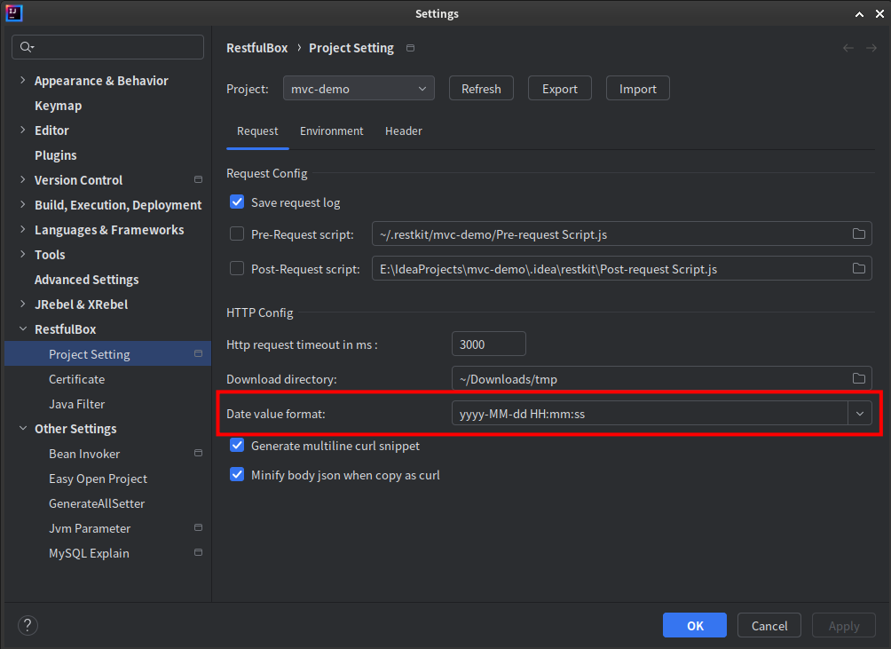
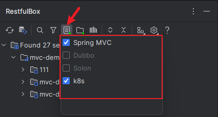
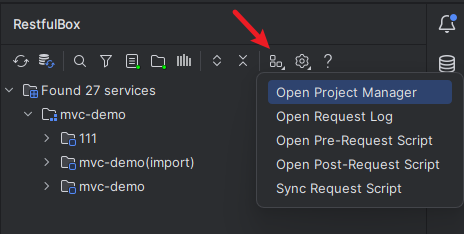
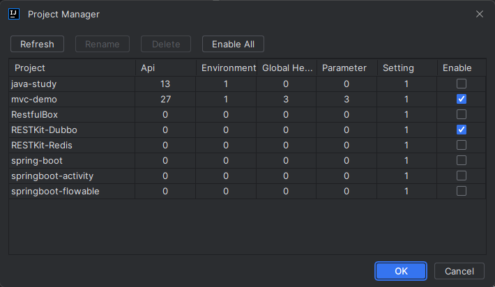
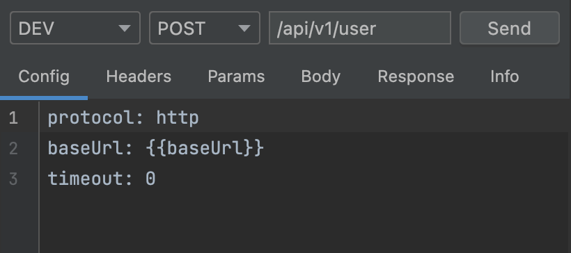

# CHANGELOG

[5.0 Upgrade Guide - 5.0升级指南](./zh_CN/快速入门/5.0升级指南.md)

5.5.0

- [API] New: supports openapi export.
- [ToolBox] New: Certificate analysis.

- [API] 新增：支持 OPENAPI 导出
- [工具箱] 新增：证书解析

5.4.0

- [API] Fixed: scanning api linemarker navigation.
- [API] New: Able to close built-in modules and customize toolbar buttons.
- [API] New: Support tag and method pattern in Search Everywhere. Format: [tag|get|post|put|patch|delete] &lt;text&gt;
- [API] New: Api management supports one-click copying of project.
- [API] New: Support setting preset parameters for Header/Params/Body.
- [API] Change: Optimize API import and export
- [API] Change: Change the file parameter identifier from file@[filepath] to @, and support binary file upload as --data-binary in curl.
- [Run Configuration] Change: Support disable parameter settings for the current project
- [Switch Project] New：Integrated project switcher. No need to install <a href="https://github.com/newhoo/easy-open-project">Easy Open Project</a> anymore

- [API] 修复：装订区域扫描接口跳转异常
- [API] 新增：支持关闭模块和自定义工具窗口按钮
- [API] 新增：随处搜索支持输入tag、method搜索，格式：[tag|get|post|put|patch|delete] &lt;text&gt;
- [API] 新增：接口管理支持一键复制项目
- [API] 新增：参数库轻松实现为Header/Params/Body等设置预置参数
- [API] 改动：优化接口导入导出，新增导出名称、目录、域名拼接等选项
- [API] 改动：文件参数标识符从 file@[filepath] 改为 @，同时支持二进制文件方式上传，参考curl中的 --data-binary
- [运行配置] 改动：新增启用开关，可为当前项目关闭参数设置
- [项目切换] 新增：集成项目切换，无需再安装：<a href="https://github.com/newhoo/easy-open-project">Easy Open Project</a>

## 5.3.0

- Fixed: Save api tag; open downloaded file.
- New: Able to cancel the HTTP request being sent finally.
- New: Support sending concurrent requests. [Request Tab right-click menu]
- New: HMAC and AES tools. Refactoring Toolbox pages.

- 修复：接口标记保存、打开下载文件
- 新增：终于能够取消正在发送中的HTTP请求
- 新增：支持发送并发请求【入口：请求Tab右键菜单】
- 新增：HMAC 和 AES加解密工具，重构工具箱页面

## 5.2.3

- Fixed known issues.
- New: Support for creating requests from simple cURL commands. \[Request tab right-click menu]
- Save-api and Copy-as-cURL entrances migrated to \[Request Tab right-click menu].
- Headers and Params editors support syntax highlighter.

- 修复已知问题，优化性能
- 新增：从 cURL 语句创建请求【入口：请求Tab右键菜单】
- 保存接口、复制为cURL按钮迁移到【请求Tab右键菜单】
- Headers 和 Params 编辑器添加语法高亮展示

## 5.2.0 - 5.2.2

- New: API searchEvery supports tag filter.
- New: Api nodes support displaying both name and URL. Change it in the Tool Window settings menu.
- New: HTTP requests support setting User-Agent header (set in the Registry).
- Optimize Toolbar: add split-screen, floating mode, double-click mode, remove scanning framework filter.
- Refactoring request panel: auto-completion of environment variables and request headers, visualize setting tab, show response state.
- Refactoring scanning api setting and merge api filtering setting.
- Fixed known issues.

- 新增: 随处搜索支持标记过滤
- 新增：树节点支持同时展示名称和 URL，在 Tool Window 设置菜单中选择展示方式
- 新增：HTTP 请求支持设置全局 User-Agent（在 Registry 中设置）
- 优化Toolbar：增加分屏、浮动模式、双击模式等设置，移除扫描框架过滤器
- 重构请求面板：编辑器支持自动补全环境变量和请求头，支持切换文档类型，可视化设置标签，展示响应状态
- 重构扫描接口设置，合并原有的接口过滤设置
- 修复已知问题

## 5.1.0

- Fixed known issues.
- New: Intelligent recognition of API documentation comments. <a href="https://github.com/newhoo/RestfulBox/blob/main/doc/zh_CN/%E6%A0%B8%E5%BF%83%E5%8A%9F%E8%83%BD/API%E6%96%87%E6%A1%A3%E6%B3%A8%E9%87%8A%E8%AF%86%E5%88%AB%E8%A7%84%E5%88%99.md">see</a>
- New：Improve the api export of Postman/Apifox types.
- New: Support import runtime environment variable from Yaml file.
- New: Support Yaml and Properties conversion. (Editor context menu)

- 修复已知问题
- 新增：智能识别API文档注释，<a href="https://github.com/newhoo/RestfulBox/blob/main/doc/zh_CN/%E6%A0%B8%E5%BF%83%E5%8A%9F%E8%83%BD/API%E6%96%87%E6%A1%A3%E6%B3%A8%E9%87%8A%E8%AF%86%E5%88%AB%E8%A7%84%E5%88%99.md">API文档注释识别规则</a>
- 新增：完善对Postman/Apifox类型的接口导出
- 新增：运行环境变量导入支持Yaml文件
- 新增：Yaml和Properties互转（编辑器右键菜单）

## 5.0.0

[5.0 Upgrade Guide - 5.0升级指南](./zh_CN/快速入门/5.0升级指南.md)

- Comprehensive refactoring for user experience.
- New: support api tag, which can be used for favorites.
- New: Runtime environment variable management. Supporting Java and Golang.
- New: Customizable replacement rules for unknown strings in api URLs.
- New: Import and export functionality for apis (Markdown/OpenAPI/Postman/Apifox).

- 全面重构，优化使用体验
- 新增：接口标记支持，可作为收藏，亦支持过滤
- 新增：运行环境变量管理，支持Java和Golang
- 新增：扫描接口URL中的未知字符串支持自定义替换规则
- 新增：接口导入导出（Markdown/OpenAPI/Postman/Apifox)

## 4.0.0

[4.0 Upgrade Guide - 4.0升级指南](./zh_CN/快速入门/4.0升级指南.md)

- Optimize two-way certificate management
- Optimize api order
- Add a useful toolbox
- Add command palette
- Add ability to open remote git without plugin <a href="https://plugins.jetbrains.com/plugin/14940-git-open">Git Open</a>
- Add ability to manage jvm parameter in IDEA/Android Studio without plugin <a href="https://plugins.jetbrains.com/plugin/13204-jvm-parameter">Jvm Parameter</a>

- 优化双向证书管理
- 优化接口排序
- 新增简体中文语言支持，在设置中切换后重启IDE
- 新增便捷的工具箱
- 新增命令中心
- 新增自动识别并打开远程git仓库功能，可无需安装插件 <a href="https://plugins.jetbrains.com/plugin/14940-git-open">Git Open</a>
- 新增Jvm启动参数管理(IDEA/Android Studio中可用)，可无需安装插件 <a href="https://plugins.jetbrains.com/plugin/13204-jvm-parameter">Jvm Parameter</a>

关联文档：
- [工具箱](zh_CN/核心功能/工具箱.md)
- [命令中心](zh_CN/核心功能/命令中心.md)
- [Git识别](zh_CN/核心功能/Git识别.md)
- [Jvm参数管理](zh_CN/核心功能/运行参数管理)

## 3.4.1

- Enable all installed restfulbox external plugin by default: [Supported Framework](https://github.com/newhoo/RESTKit/blob/main/doc/zh_CN/%E5%BF%AB%E9%80%9F%E5%85%A5%E9%97%A8/%E9%85%8D%E7%BD%AE.md#%E6%94%AF%E6%8C%81%E7%9A%84%E6%89%AB%E6%8F%8F%E6%A1%86%E6%9E%B6);
- Fix bugs

- 默认启用所有安装的扫描插件：[支持的扫描框架](https://github.com/newhoo/RESTKit/blob/main/doc/zh_CN/%E5%BF%AB%E9%80%9F%E5%85%A5%E9%97%A8/%E9%85%8D%E7%BD%AE.md#%E6%94%AF%E6%8C%81%E7%9A%84%E6%89%AB%E6%8F%8F%E6%A1%86%E6%9E%B6)
- 修复已知问题

## 3.4.0

- Optimise searchEverywhere matching logic, disable description matching by default;
- Can set dateFormat with project setting;

- 优化searchEverywhere搜索接口, 默认禁用description匹配
- 支持自定义时间格式: ProjectSetting

## 3.3.1

- fix exception in 2024.1;

## 3.3.0

- Fix bugs
- Add Jax-RS api support(Java and kotlin) directly. Abandon RESTKit-JAX-RS plugin.
- Update libs(9.4M)

## 3.2.1

- Fix bugs: download file exception
- Fix bugs: config lost bug.

- 修复下载文件bug
- 修复配置丢失bug
- 非Windows用户可在 `registry` 中设置部分UI显示比例 `restkit.ui.scale`

## 3.2.0

- Optimize & Fix bugs.
- Change UI configs from project level to global level.
- Support exporting and importing parameters.
- Support displaying multi-level service tree and multiple request tabs with limit. All user can disable these in plugin setting.
- New project manager ui.

- 修复bug，优化细节
- 调整部分配置入口，UI配置升级为全局有效
- 新增支持导出导入请求参数
- 非订阅用户支持有限的多层级树节点展示和多请求面板，所有用户均可在设置中关闭
- 新增项目数据管理面板

其他说明：

1、扫描框架设置入口迁移到 Toolbar

2、请求参数导入导出入口：

3、项目数据管理面板

4、全局项目切换入口

5、关闭多层级树节点展示和多请求面板

## 3.1.1

- Fix compatibility issue with IDE 2023.2

## 3.1.0

- Fix bugs.
- Premium: Support displaying or sending multiple requests at the same time. [see](https://github.com/newhoo/RESTKit/blob/main/doc/zh_CN/%E5%BF%AB%E9%80%9F%E5%85%A5%E9%97%A8/%E7%AA%97%E5%8F%A3%E4%BB%8B%E7%BB%8D.md#request-client)

- 修复bug；
- 高级功能: 新增支持展示多个请求面板, 可同时发起多个请求；[详见](https://github.com/newhoo/RESTKit/blob/main/doc/zh_CN/%E5%BF%AB%E9%80%9F%E5%85%A5%E9%97%A8/%E7%AA%97%E5%8F%A3%E4%BB%8B%E7%BB%8D.md#request-client)

## 3.0.3

- Optimize high-resolution screen display.
- Optimize file settings.
- Support environment variable for request body.
- Support to minify json content.
- Support to set environment variables in pre-request and post-request script.
- Fix bugs (curl, parameter delete exception).

- 优化高分辨率屏幕显示;
- 优化全局文件目录设置;
- 请求body支持环境变量;
- 支持压缩JSON;
- 前置/后置脚本支持设置环境变量;
- 修复bug (curl复制、参数库删除异常).

## 3.0.2

- Optimize & Fix bugs.
- All tab support saving content.

- 修复bug.
- 全部Tab支持保存内容.

## 3.0.1

[3.0 Upgrade Guide - 3.0升级指南](./zh_CN/快速入门/3.0升级指南.md)

- Optimize & Fix bugs.
- Support parsing constants in springmvc mappings.
- Support MySQL datasource.
- Optimize document.

- 修复bug.
- 支持解析springmvc mapping中的常量.
- 支持MySQL数据源.
- 更新文档.

## 3.0.0

https://plugins.jetbrains.com/plugin/14723-restfulbox/versions/stable/277327

- Optimize & Fix bugs.
- New UI.
- Premium(paid): Support multi level service tree.
- Premium(paid): Support custom dataSource, view service items crossing projects.

- 细节优化，解决一些遗留问题.
- 新UI支持.
- 高级功能(付费): 支持多层级service tree.
- 高级功能(付费): 新增数据源，跨项目访问其他项目接口，提供扩展点对接三方平台/数据库.

_由于国内某些同类付费插件大量抄袭了本插件功能，且参差不齐，因此3.0之后的源码不再开放，如有插件开发的问题（不限于技术问题），可以在本GitHub地址提问。_

## 2.0.8

- Support ssl.
- Optimize http request, support upload/download file.
- Optimize curl.

- 支持SSL（单项认证和双向认证）
- 优化http请求，支持上传下载文件
- 优化复制curl

## 2.0.6

- fix bugs with 2022.2

## 2.0.5

- Add icon for springmvc mapping methods. Enable [Jump to tree using method line marker] in the setting.
- Remove jump to tree intention.

- 添加图标，支持springmvc方法快速生成请求，在设置中启用【Jump to tree using method line marker】
- 移除上下文菜单中的跳转到树窗口

## 2.0.4

- Optimize details.

- 优化细节

## 2.0.3

- support api group by file name.
- support rest client ep.
- support param filter for springmvc

- 扫描的API支持按文件名显示分组
- 发送请求提供扩展点，即将提供Dubbo服务支持.
- springmvc接口扫描支持param参数过滤

## 2.0.2

- more powerful api local store, support synchronization in different IDE.
- fix bugs.

- API本地存储升级，支持跨IDE同步

## 2.0.1

- support more jetbrains ides.
- support api local storage, export and import by default.
- most particular optimization.

- 支持更多的jetbrains产品
- 默认支持API本地存储/导出/导入
- 大量细节优化

## 2.0.0

- add extension for scanning restful services from other web framework.
- support some common config.
- support pre-request and post-request script.

- 提供扩展点，支持自定义web框架中的接口扫描与展示
- 增加一些通用配置
- 支持请求前置/后置脚本

## 1.0.8

- Integrate URL search into native Search Everywhere for idea 211.*.
- support scan library services.
- support environment migration.
- support restfull client parameter operation(Headers/Params/Body).

- 在Search Everywhere中集成URL搜索
- 支持扫描依赖包的接口
- 环境支持导出导入，一键迁移
- 支持restfull client参数操作(Headers/Params/Body)

## 1.0.7

- Integrate URL search into native Search Everywhere for idea 203.*.

- 在Search Everywhere中集成URL搜索 (idea 203.*)

## 1.0.6

- Integrate URL search into native Search Everywhere.

- 在Search Everywhere中集成URL搜索

## 1.0.5

- fix bugs.

## 1.0.4

- fix bugs.

## 1.0.3

- show http request info.
- update custom logging format.
- fix known issues and support 2021.2.

- 显示HTTP请求信息
- 更新日志打印格式
- 修复已知问题，兼容2021.2

## 1.0.2

- fix compatibility problems with 2020.

- 修复2020版本兼容性问题。

## 1.0.1

- print request logs to file (path: `$PROJECT_PATH$/.idea/restkit/*.log`);
- parse header from springmvc annotation.
- support copying current Environment(can use to rename if you want).

- 请求日志输出到文件（path: `$PROJECT_PATH$/.idea/restkit/*.log`）;
- 解析header (已验证java语言);
- 支持复制当前环境变量（可间接重命名）。

## 1.0.0

- support jump to api in tree window from Controller method ( use: ⌥ + ↵) ;
- more useful http client: supporting global request header/environment and request script, delete requests support body, param/body mocking more powerful, etc.
- fix bugs, remove useless function.

- 支持从方法跳转到tree窗口中对应的接口（在方法上按⌥ + ↵，如不存在需先刷新接口）;
- http工具更好用，支持全局请求头、环境变量和请求脚本，delete支持body参数，mock参数识别增强等等;
- 修复兼容性问题，去除了用处不大的功能（右键copy full url等）。

