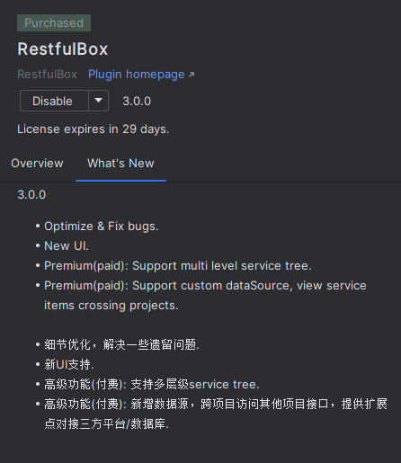
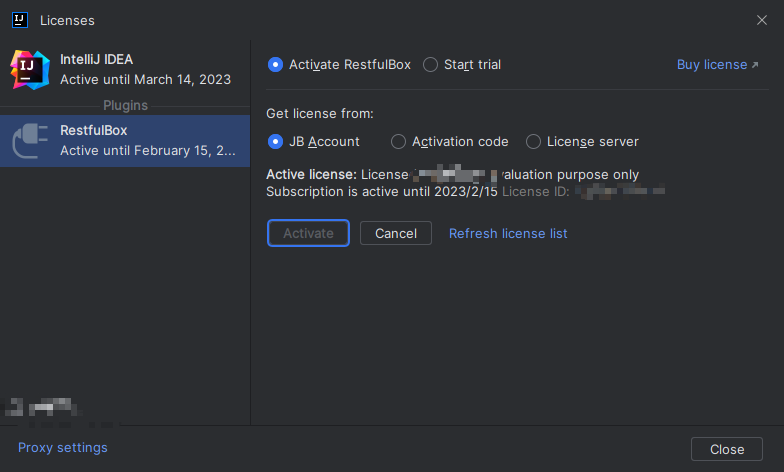
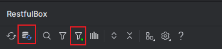

# 3.0升级指南

## 一、概述
主题：开放

从3.0版本开始，RESTKit更名为**RestfulBox**，初心不变。同时，新版本部分功能提供付费订阅，但已有功能完全免费，且最大程度兼容历史版本数据。

## 二、新功能
### 1、细节优化
包括自动识别springmvc项目的上下文路径等。

### 2、新UI支持
- 插件设置界面调整；
- 接口图标更新，如开启IDE New UI，将同步开启插件New UI风格图标。

### 3、多层级service tree
- 非订阅用户最多只有2个打开项目支持多层级，订阅用户无限制，可在设置中关闭。
- 开启后可查看项目、模块、包/类多层级树结构，更加清晰

### 4、自定义数据源，跨项目跨IDE访问接口
- 此为订阅功能。
- 新增多数据源支持，目前包括Ide和Sqlite方式，可管理范围包括API、环境变量、参数库、项目级别配置、全局配置、证书。
- 重构底层代码，支持跨项目跨IDE访问其他项目接口，即在一个窗口中查看/维护/调用所有添加过的项目接口。
- 同时提供了扩展点，可方便地对接三方平台/数据库。

### 5、多请求Tab支持
- 非订阅用户每个项目最多支持2个标签，订阅用户无限制，可在设置中关闭。
- 可同时展示、发起多个请求。

### 6、开放
- 优化了现有的插件扩展点，便于用户更好地自定义集成接口扫描；
- 新增接口级别的详情扩展，包含图标、双击事件、展示详情等；
- 新增数据源扩展，可方便地对接三方平台/数据库。

## 三、升级
通过jetbrains IDE（2021.2+）安装/升级插件到3.0.0版本。安装后需重启IDE。

## 四、订阅
如未订阅，插件仍可以正常使用，包括之前的所有功能。[订阅管理](https://account.jetbrains.com/licenses)

:fire: **_如果你想更加充分地体验订阅功能，作者免费赠送3个月使用。如有需要，可通过邮件联系作者，备注好需求和你的 [Jetbrains邮箱账号](https://account.jetbrains.com/profile-details) !!_**

### 订阅方式：

打开方式：
IDE：Help -> Register

如未订阅，可在IDE 插件设置中点击激活按钮，关闭设置后可打开激活弹窗。点击某些按钮也可触发订阅窗口。

### 订阅查询：
查询已订阅内容，可下载激活码离线激活，官方地址：https://account.jetbrains.com/licenses

## 五、其他说明
3.0之后的源码选择性开放，如有插件开发的问题（不限于技术问题），可以在GitHub提问或者发邮件给我。
