# 5.0升级指南

## 一、概述

主题：重构 + 体验

支持从`4.x`版本直接升级，数据完全兼容，IDE支持最低版本为`2021.3`。

## 二、新功能

### 1、重构优化

- 多项目打开方式重构：每个项目的接口相互隔离展示，不再放于同一棵树中。
- 接口树：
    - 支持无限层级，目录层级以`/`分割。扫描接口默认为`module`和`controller`2级，可设置不展示`module`。
    - 树节点支持同时展示名称和 URL，同步"随处搜索"中的展示。
    - 取消单击事件，双击事件可设置为跳转源码和显示请求内容。
    - 复制URL调整为复制完整的URL，自动从当前选中的环境变量中读取`baseUrl`拼接。
- 请求客户端
    - 强化请求标签：无数量限制，通过标题右键菜单操作，可跳转到源码和接口树节点。
    - 请求参数编辑新增环境变量选择按钮，位置同上，支持选择内置变量。
    - 编辑器支持自动补全环境变量、请求头及特殊操作（选择上传文件）
    - 支持切换文档类型，可视化设置标签，展示响应状态
    - HTTP 请求支持设置全局 User-Agent（在 Registry 中设置）
    - 参数库支持为Header/Params/Body等设置预置参数
    - 文件参数标识符从 file@[filepath] 改为 @，同时支持二进制文件方式上传，参考curl中的 `--data-binary`
- 优化 Toolbar：增加分屏模式、浮动模式、双击模式、打开请求历史等设置，移除扫描框架过滤器，支持自定义隐藏
- 导入导出接口重构，不再支持原有剪贴板方式。
- 工具箱优化界面，展示方式由弹窗改为编辑器tab，编辑器右键菜单添加打开入口。
- 国际化优先使用内置的文案，建议搭配官方的语言插件使用。
- 随处搜索支持标记过滤，支持输入tag、method搜索，格式：[tag|get|post|put|patch|delete] &lt;text&gt;
- 重构扫描接口设置，合并原有的接口过滤设置

### 2、新增接口标记管理

- 在接口右键菜单中，点击【管理标记】，对当前接口新增删除标记。

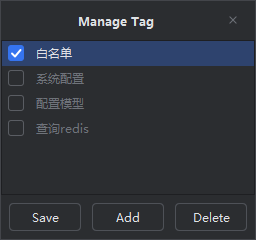

- 按标记过滤：在 `Toolbar`按钮中选择【标记过滤】按钮进行操作，选中会自动刷新接口树，只展示选中的接口；未选择则展示所有的接口。

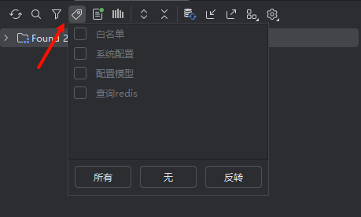

- 自动扫描接口中的文档注释作为标记（`@tag`、`@version`、`@since`等）

### 3、扫描接口支持自定义文档注释识别

参阅：[API文档注释识别规则](../核心功能/API文档注释识别规则.md)

### 4、导入导出API

- 导入API：`Toolbar`中的导入按钮。

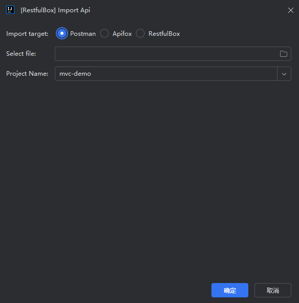

- 导出API：`Toolbar`中的导出按钮，接口树节点右键菜单`Export`。

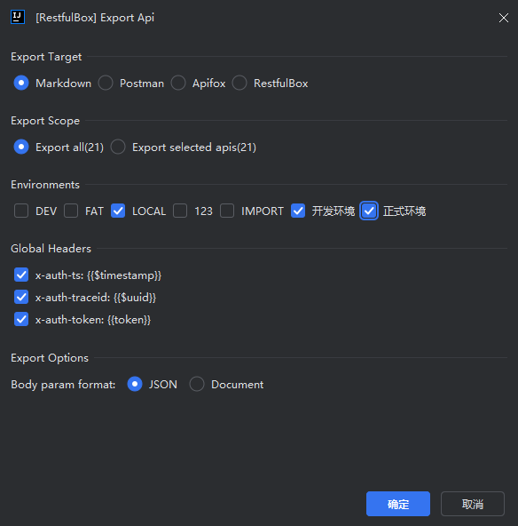

### 5、扫描接口URL中的未知字符串支持自定义替换规则

对于扫描接口URL中的未知字符串，可自行配置替换规则，如 `${a.a}`替换为`/api`。可用于Mapping注解中包含常量等场景。

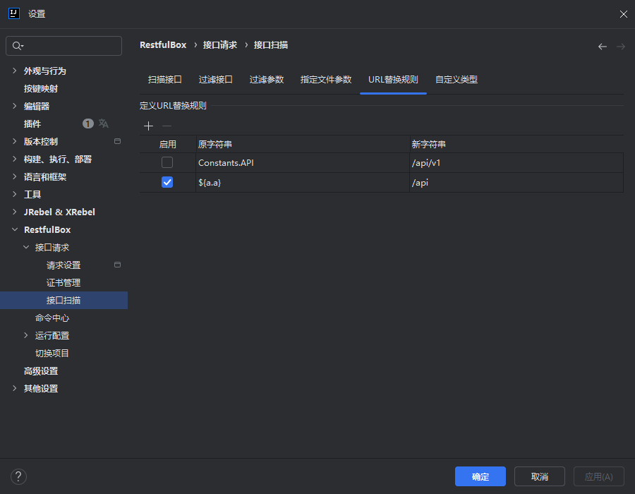

### 6、视图设置说明

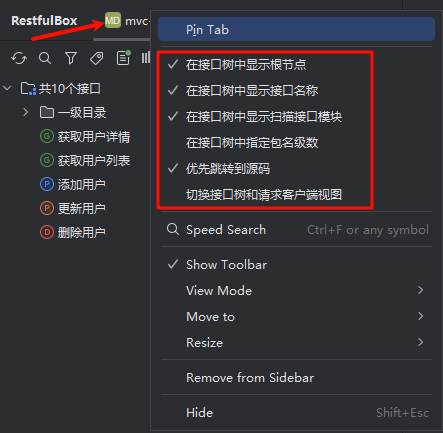

- 在接口树中显示扫描接口模块：对扫描接口有效

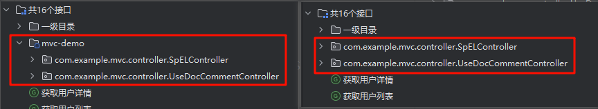

- 在接口树中指定包名级数：按`.`分割

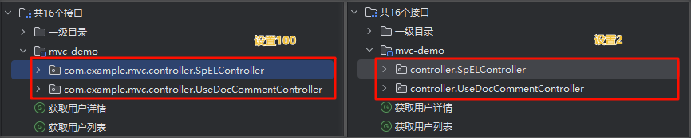

- 优先跳转到源码：选中时双击接口会跳转到源码，未选中时双击会自动打开接口。

- ToolWindow视图切换

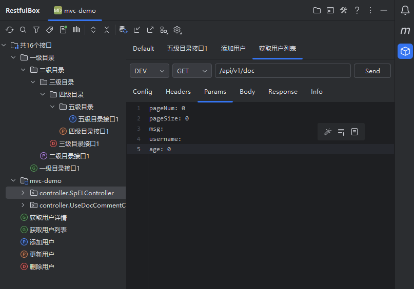

### 7、新增并发请求

在请求面板标题右键菜单点击【Concurrent Request】或【并发请求】。在弹出面板中设置并发数量，可选择保存请求日志，然后发起请求。

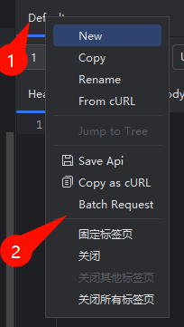

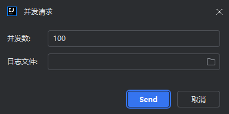

### 8、新增运行时环境变量管理

- 支持 Java 和 Golang，启动应用时自动设置到应用的环境变量中
- 在设置中管理环境变量，可导入导出
- 文档: [运行参数管理](../核心功能/运行参数管理.md)

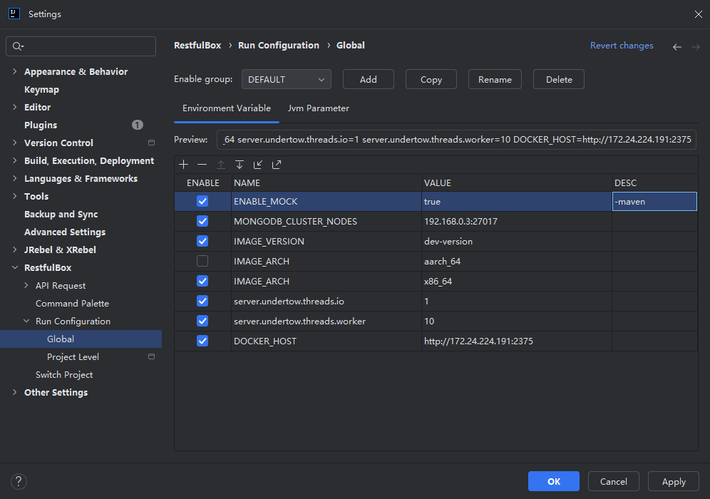

### 9、新增项目切换管理

- 支持在随处搜索中快速打开、关闭、切换项目
- 文档: [项目切换管理](../核心功能/项目切换管理.md)

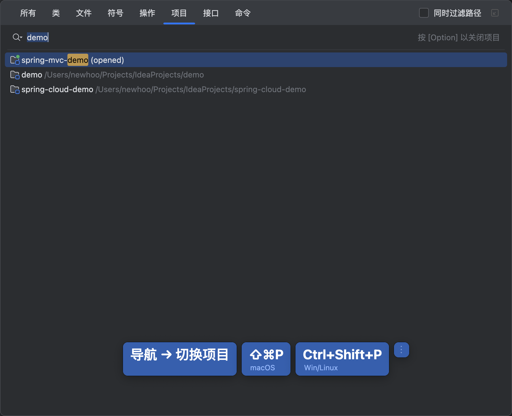

## 三、升级

通过jetbrains IDE（`2021.3+`）安装/升级插件到5.x版本。安装后需重启IDE。如数据源使用了数据库方式，则需从`4.0`升级。

## 四、订阅

`5.5`开始取消订阅，所有功能无限制地使用。

## 五、其他说明

- 开源版本源码已更新到 4.0 最新版本，涉及订阅功能部分暂时隐藏，开发者可自行构建开源版本使用。
- 如有插件开发/使用的问题（不限于技术问题），可以在GitHub提问或者发邮件给我。
- 开发维护不易，好用的话请帮忙推荐给身边的朋友同事，这也是对作者的支持！
