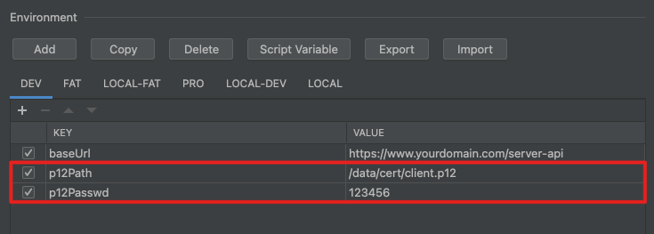

# HTTPS请求

## 一、概述

https请求分为单向认证和双向认证。从`2.0.8`开始支持。
本插件对于单向认证，会信任所有来源的服务端证书，即不做校验，相当于 **curl** 中的 `-k`；对于双向认证，同样会信任所有来源的服务端证书，同时需要配置本地客户端证书。

## 二、单向认证
`baseUrl`中以 `https://` 开头，无需其他配置。

#### 【Copy as Curl】示例
```bash
curl -X GET https://www.yourdomain.com/server-api/health -k
```

## 二、双向认证【新，2.1.2及以上】
`baseUrl`中以`https://`开头，其他配置如下。

#### 证书全局管理
如图。双击单元格编辑内容；选中【PFX file】单元格，右键双击可选择文件。


#### 【Copy as Curl】示例
```bash
curl -X GET https://www.yourdomain.com/server-api/health -k --cert-type P12 --cert /data/cert/client.p12:123456
```

## 三、双向认证【旧，2.0.8-2.1.2】
`baseUrl`中以`https://`开头，其他配置如下。

#### Config Tab

建议在环境变量中配置变量`p12Path`和`p12Passwd`，如未配置，则https请求时会视为单向认证。一般会自动生成，也可通过右键菜单添加。


#### 环境变量
`p12Path`：client客户端证书位置，本地绝对路径，p12类型
`p12Passwd`：client p12证书访问密码



#### 【Copy as Curl】示例
```bash
curl -X GET https://www.yourdomain.com/server-api/health -k --cert-type P12 --cert /data/cert/client.p12:123456
```
