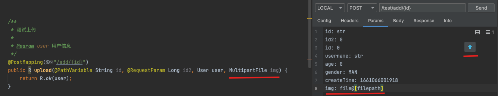
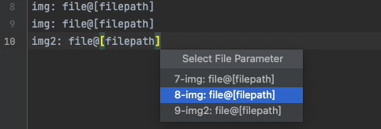

# HTTP上传/下载文件

## 一、概述
从`2.0.8`开始支持，不建议在idea中下载大文件。

## 二、上传文件
支持`org.springframework.web.multipart.MultipartFile`参数识别。



在 **Params编辑窗口** 中，文件参数表现为：`paramName: file@[filepath]`，包含该格式参数后，会出现一个上传文件的按钮⬆️，点击即可选择要上传的文件。如包含多个文件，则按从上到下列表进行选择，如图：




同其他http请求一样，点击发送即可。在接口断点查看参数，如图：


## 三、下载文件
设置下载目录：RESTKit -> HTTP -> Download directory
根据响应头中的`Content-Disposition`或`Content-type: application/octet-stream`识别为下载文件，如：
```
Content-Disposition: attachment; filename="2d8e6de174899729ccd12f41230a5510.webp"; filename*=utf-8''2d8e6de174899729ccd12f41230a5510.webp
```
下载完成后在**Body编辑器**中会显示下载文件的绝对路径。
