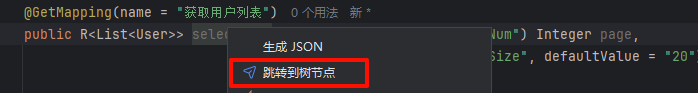
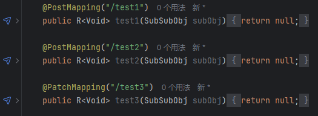
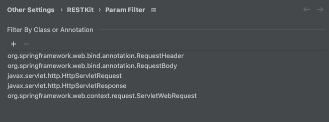
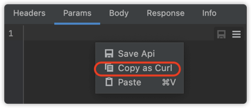

# 其他使用

## Java Method 跳转到 api tree

- Java方法上右键

_如果启用了 Line marker 图标跳转，则不会显示此跳转方式_

- Line marker 图标跳转

**_从2.0.5开始支持，可以在设置中关闭【_**_在源码中显示接口导航图标_**_】_**

## Java 识别参数过滤
找到设置【API Setting】，添加需要过滤的类名或包含的注解名称

## Java 类生成 JSON
在需要生成的Java类名称上右键，在弹出的菜单中选择 `Convert to JSON`

## 复制为 cURL
在 request client tab 右键菜单中点击【复制 cURL】

