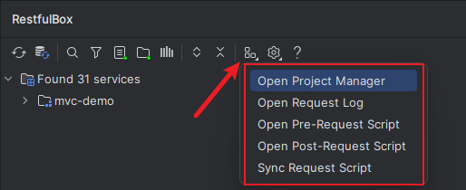

# 其他使用

## Microservice Feature
_由于这块API不稳定，从2.1.2移除_

Url navigate to service tree.

## Java Method跳转到service tree

- Java方法上右键

_如果启用了Line marker图标跳转，则不会显示此跳转方式_

- Line marker图标跳转

**_从2.0.5开始支持，可以在设置中关闭【_**_Jump to tree using method line marker_**_】_**

- ~~光标移到Java中的方法上，点击💡或者按 `⌥ ↩`~~，从`2.0.5` 开始移除

## Java识别参数过滤
找到设置【Param Filter】，添加需要过滤的类名或包含的注解名称

## Java类生成JSON
在需要生成的Java类名称上右键，在弹出的菜单中选择 `Convert to JSON`

## 复制为curl
在http client任意编辑区右键菜单中点击【Copy as Curl】

## 快捷工具
操作路径：*Plugin Toolbar > Show Tools*

## 导出到Postman
导出方式：
1. 在列表中选中API，编辑好参数；
2. 在http client任意编辑区右键菜单中点击【Copy as Curl】；
3. 在Postman中点击导入，选择【Raw text】，直接粘贴上一步复制的curl命令，确定后完成导入。