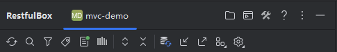
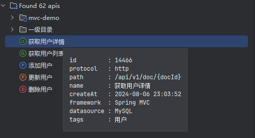
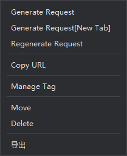
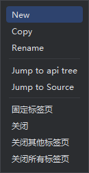

# 窗口介绍

## 概述

打开项目，找到窗口右边的**RestfulBox**，打开。窗口主要由 **顶部按钮组**、**api tree**、**request client** 构成。以下分别介绍。

## 顶部按钮组

### 顶部按钮

- 项目看板
- 命令中心：在“随处搜索”打开命令中心
- 工具箱：打开工具箱
- 文档：提供在线文档地址

### Toolbar

- 刷新：如果没有找到更新的api，点击刷新图标
- 搜索：打开search everywhere搜索service url
- 过滤方法：按照http method过滤API
- 过滤标记：按照自定义标记过滤API
- 启用扫描框架：按照扫描框架过滤API
- 启用扫描依赖：选中时可搜索依赖包中的API
- 展开/折叠：对接口列表进行展开或折叠
- 同步：点击同步接口到数据源，可在设置中指定数据源
- 工具：API相关常用工具
- 设置：可打开插件配置和环境变量配置

## api tree

- 按模块展示项目中搜索到的接口，支持idea自身的输入搜索
- 在URL上双击，可选中接口或跳转到源码
- 在URL上右键，展示右键菜单

## Request client

- **Tab选择**：自动开启多请求Tab选项，各个Tab相互独立。在Tab标题右键可新建/关闭/跳转源码等操作。

- **环境变量**：下拉选择已添加的环境变量组，不存在时会跳转到环境变量配置页面。鼠标Hover时可预览当前环境变量
- **Method**：http method，一般不需要手动选择
- **URL**：http请求的uri，一般不需要手动输入。支持占位符。
- **Send**：点击发送一次请求
- **Config**: 请求的配置，由发送请求的client提供，如http请求会生成 baseUrl 和 timeout 。第一条固定为 `protocol: 具体协议`
  。一般请勿删除该文本下的键值对。
- **Headers tab**: 请求头参数，通常会自动生成。支持占位符和参数库操作。
- **Params tab**: 包括uri路径参数、查询参数和form参数，通常会自动生成。支持占位符和参数库操作。
- **Body tab**: POST/PUT/PATCH/DELETE对应的body参数，通常会自动生成。支持占位符和参数库操作。
- **Response tab**: 展示请求返回的结果。内容可能是正常返回、异常返回、后置请求脚本返回结果。
- **Info tab**: 展示请求信息。

悬浮按钮

- 选择环境变量：对参数应用环境变量等信息
- 保存/查看参数内容：参阅[参数库](../核心功能/参数库.md)
- 打开文件：打开下载文件所在文件夹