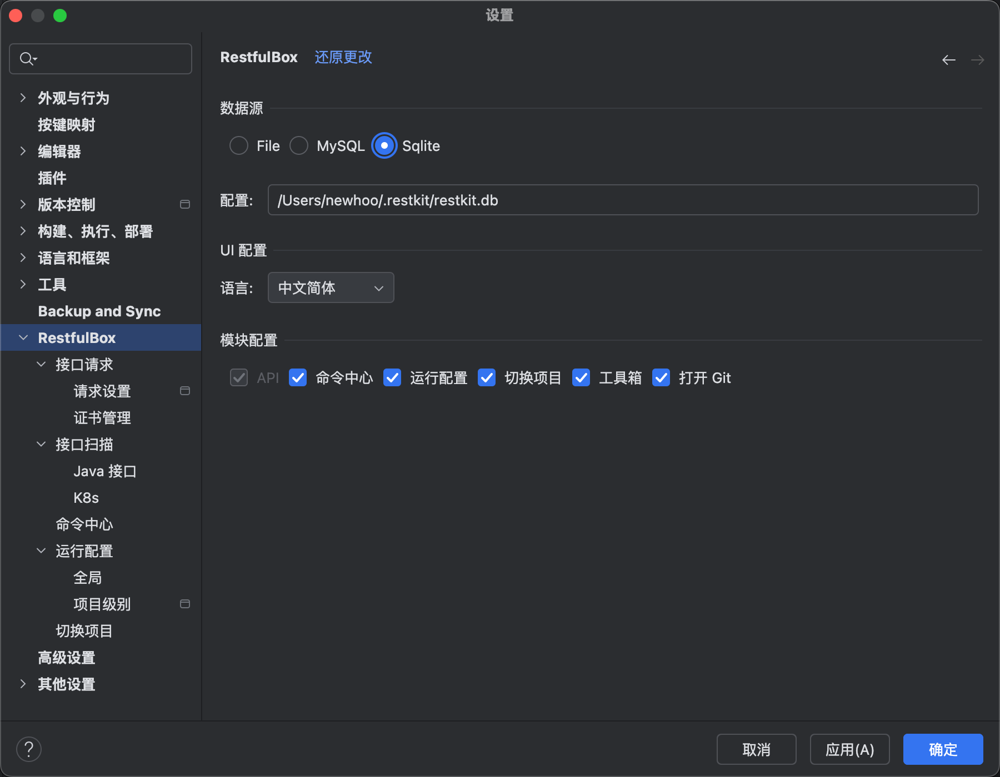
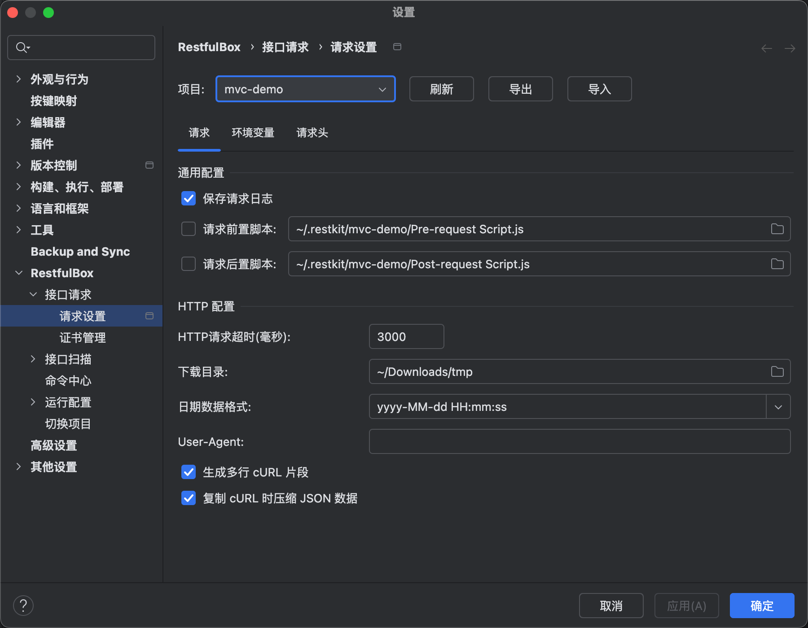
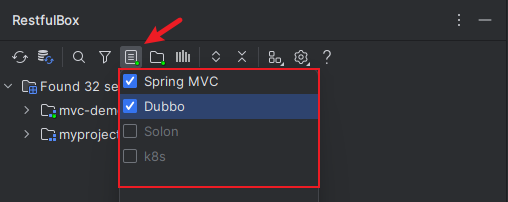

# 插件配置

## 操作路径：

- Preferences(Settings) > RestfulBox

## 全局配置

### 数据源配置

配置数据源：可选择已支持的数据源，根据提示填写相应的配置（双击Config可生成默认配置）。

- Ide: idea自带方式管理数据，即旧版本方式。Config为空即可。
- Sqlite: sqlite数据库。Config指定为`sqlite文件位置`，文件不存在时会自动创建。
- MySQL: mysql数据库。Config默认为 `{"url":"jdbc:mysql://127.0.0.1:3306/restkit?useUnicode=true&characterEncoding=utf8&useSSL=false","username":"root","password":"123456"}`, 需自行修改。

### UI配置

- 是否启用接口处的导航图标
- 智能识别API接口分组

## 项目配置

配置所选项目的请求选项、环境变量和请求头等。

### 请求配置

- 启用保存请求日志：默认启用，保存路径为 `{user.home}/.restkit/{projectName}/logs/*.log`
- 请求脚本：设置前置/后置请求脚本路径。当输入框为空时，可双击`Label`自动生成脚本，默认生成路径为：`{user.home}/.restkit/{projectName}/xxx-request Script.js`
- http请求超时：设置请求超时时长，设置时长小于等于0时为30s
- 下载目录：下载文件目录
- 默认时间格式：选择时间字段生成值的默认格式
- cURL选项

### 支持的扫描框架

对于idea，默认支持**Spring MVC**和**Jax-Rs**，包括Java和kotlin的实现。

勾选即启用，若需要支持其他框架的restful接口，请参考：[插件扩展](../扩展/扩展简介.md)
