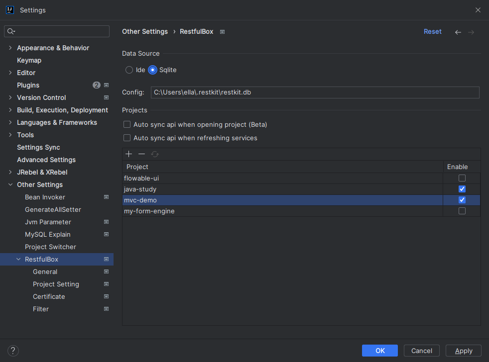
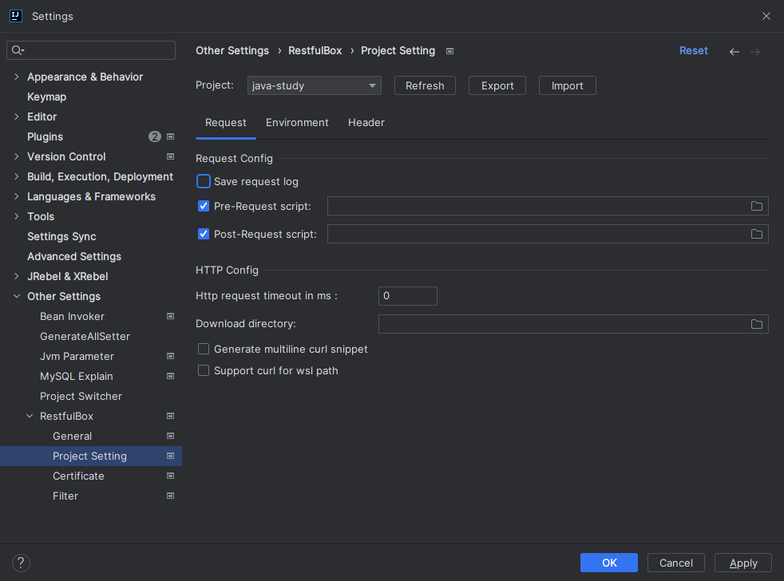

# 插件配置

## 操作路径：

- Preferences(Settings) > Other Settings > RestfulBox

## 数据源配置

配置数据源：可选择已支持的数据源，根据提示填写相应的配置（双击Config可生成默认配置）。
管理项目：对项目进行管理，可添加、删除、启用。

## 通用配置
此部分配置不同步到数据源。

### 支持的框架
目前支持类型包括扫**描类型**和**存储类型**。扫描类型支持由源码解析得到，不支持增加/更新/删除等操作。存储类型用于自定义API的增删改查，需自行提供存储方式，如文件存储、redis存储等。

对于所有的jetbrains ide，默认提供**Local Store**，通过本地文件方式存储API。路径设置参考下文的其他配置。
对于idea，默认支持**Spring MVC**，包括Java和kotlin的实现。

勾选即启用，若需要支持其他框架的restful接口，请参考：[插件扩展](#%E6%8F%92%E4%BB%B6%E6%89%A9%E5%B1%95)

### UI配置

- 在search everywhere中展示URL的module名称
- 使用接口所在文件名作为分组名，默认使用模块名，_可由扩展插件自定义实现_
- 使用接口描述作为接口名称，默认使用URI
- 启用参数库：默认启用。设置后需重新打开当前项目

## 项目配置

配置所选项目的请求选项、环境变量和请求头等。

### 指定插件数据目录（可选）
在电脑的环境变量中配置：**RESTFUL_DIRECTORY**，windows可能需要重启系统。
若不设置，则使用`user.home`

### 请求配置

- 启用保存请求日志：默认启用，保存路径为 `插件数据目录/.restkit/logs/*.log`
- 请求脚本：设置前置/后置请求脚本路径。当输入框为空时，可双击`Label`自动生成脚本，默认生成路径为：`$PROJECT_DIR$/.idea/restkit/xxx-request Script.js`
- http请求超时：设置请求超时时长，设置时长小于等于0时不超时
- 下载目录;：下载文件目录
- curl选项

## 其他配置

- 参考相应章节
