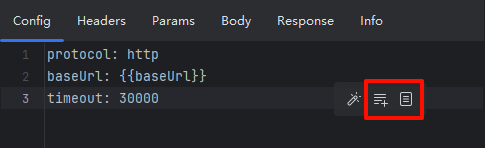
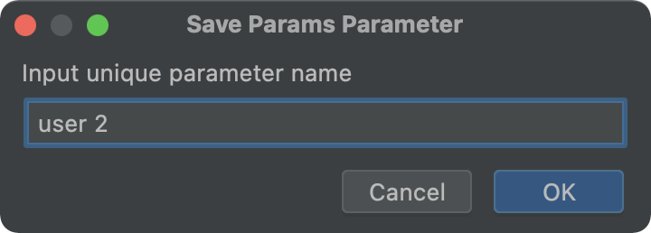
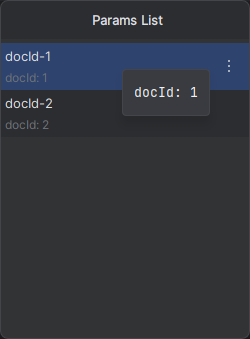
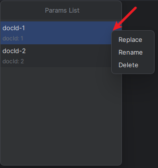
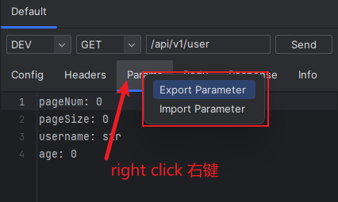

# 参数库

## 概述

- 参数库是用于保存请求参数的仓库，支持保存 Headers、Params 和 Body 等参数。
- 参数库存在多个，**每个参数库和URL、method 唯一绑定**。
- 显示在对应编辑器中的悬浮按钮，分别对应 **保存** 和 **选择** 参数。
- 局部快捷键：从`2.1.1`开始支持，**光标需在对应的编辑区**。保存参数：`control S`，查看参数列表：`control shift S`

## 保存参数

保存当前编辑好的参数，以便留给将来使用。点击 `Save` 图标，输入唯一的名称。

## 使用参数

点击 `List`图标，可以看到当前URL和method绑定的参数库。

- 鼠标Hover时会预览当前选择的参数
- 单击鼠标左键，当前选择参数会替换对应编辑器的内容

## 管理参数

在参数列表中，每一行对应一个 `Setting` 图标，点击可对该参数替换、重命名和删除。

- **设为预置**: 预置参数支持在其他接口中查看及使用
- **Replace**: 使用当前编辑器中的内容来替换选中项
- **Rename**
- **Delete**

## 导入/导出

对着Tab标题右键，弹出菜单，进行相应操作。

## 清空所有参数

通常不需要操作。数据源选择为`File`时可找到文件 `{user.home}/.restkit/{projectName}/parameter-library.json`进行删除。
