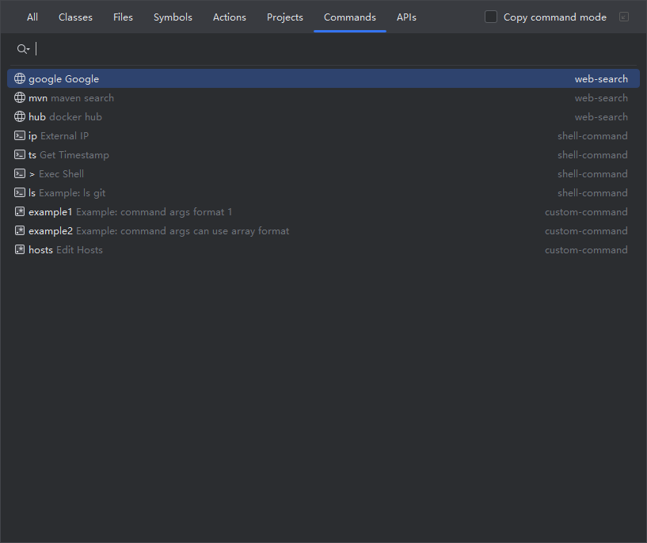
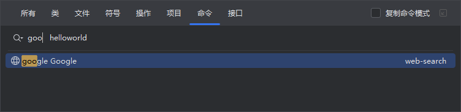
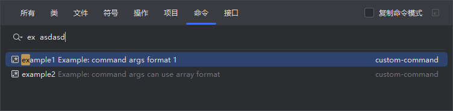
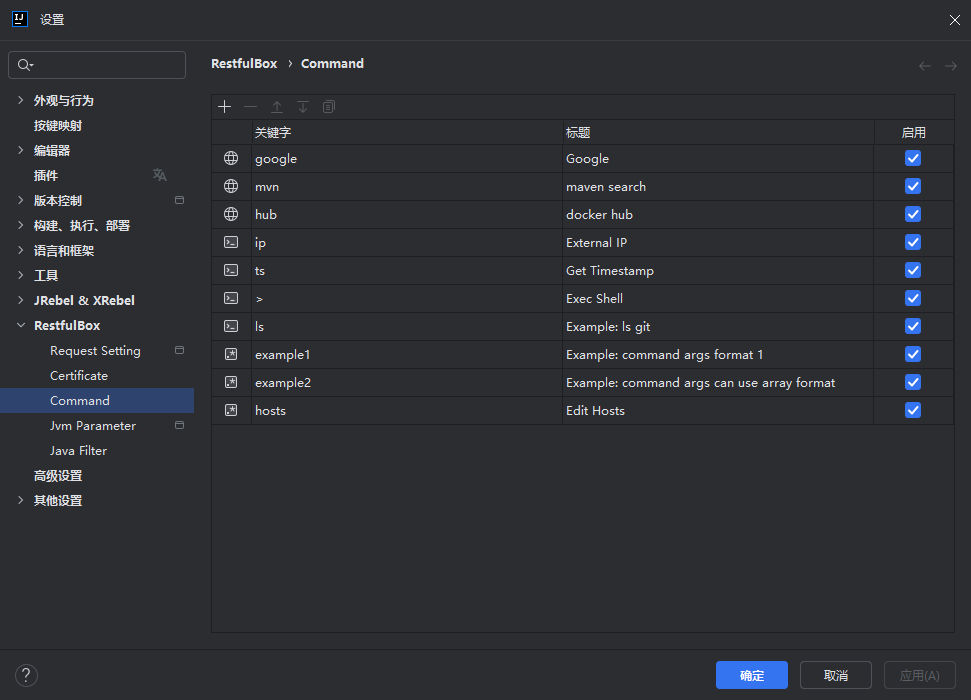
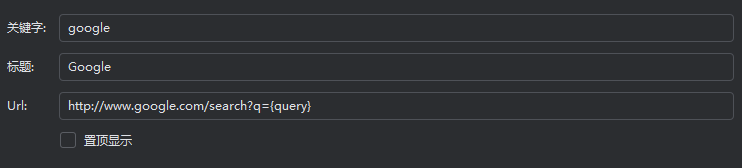
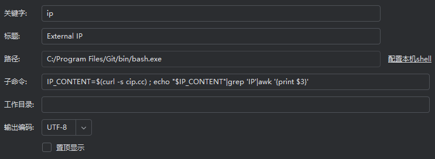
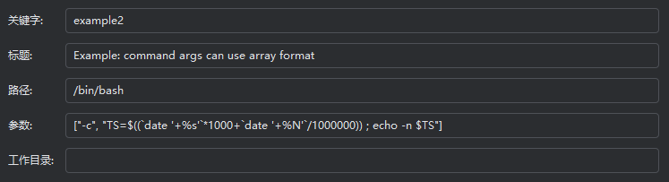
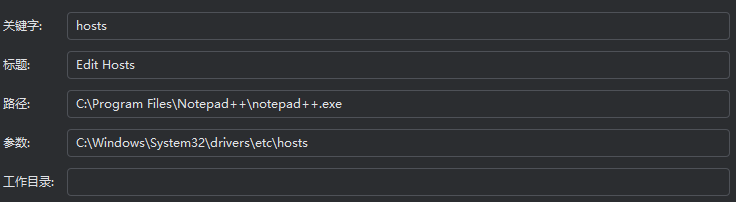

# 命令中心

## 概述

命令中心是一个支持管理及使用自定义命令的能力，支持多种类型的命令，可在“随处搜索”中快速掉调用，通过合理配置及使用，可减少开发过程中频繁地切换应用，提供开发效率。

## 使用

在“随处搜索”中切换到`命令`标签，在不输入内容时将展示所有启用的命令列表，输入命令关键字，展示匹配的命令。

输入格式：`关键词 + 空格 + 其他内容`

替换`{query}`规则：

- 输入内容以关键词开头，取空格后其他内容
- 输入内容不以关键词开头，若设置了置顶，取全部输入内容
- 输入内容不以关键词开头，且未设置置顶，取空格后的其他内容，即支持关键词前缀匹配

## 管理

在设置中配置及管理命令，选中即展开编辑控件，完成后点击确定保存。

### 命令类型

- `web-search`: 适用于浏览器搜索。
- `shell-commmand`: shell命令类型，用于执行shell命令，需指定一次本机的shell路径，每条shell命令需配置子命令。
- `custom-command`: 自定义命令类型，可自行配置命令路径和参数。

### 编辑命令

添加指定类型的命令后，编辑相应参数。

通用参数介绍：

- 关键字：用于在“随处搜索”中输入关键字快速定位匹配的命令
- 标题：命令名称
- 置顶显示：若勾选，在“随处搜索”中将展示在最前面

特定类型命令参数介绍：

1. `web-search`

- `Url`: 浏览器地址，搜索内容占位符为`{query}`，执行时将自动替换

2. `shell-commmand`

- 路径：不可编辑，默认识别本机环境变量中的shell，如不准确，可点击右侧【配置本机shell】选择本机shell位置
- 子命令：真正要执行的语句，执行时作为shell参数 `-c` 后的内容；支持自动替换占位符`{query}`
- 工作目录：命令执行的工作目录
- 输出编码：命令输出内容的编码

3. `custom-command`

- 路径：执行命令路径
- 参数：执行命令的参数，支持两种格式，如下图；支持自动替换占位符`{query}`
- 工作目录：命令执行的工作目录
- 输出编码：命令输出内容的编码

注意：执行shell命令和自定义命令时会等待结果，默认等待耗时5s，当前需在数据库配置自定义时长，不建议在此类命令中做耗时操作，如打开GUI软件。

### 启用/禁用命令

命令禁用后不会出现在“随处搜索”中。

### 排序

选中命令后，根据`向上`和`向下`箭头移动命令位置即可控制“随处搜索”中的命令顺序。置顶的命令不受此操作控制顺序。
