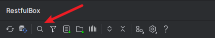
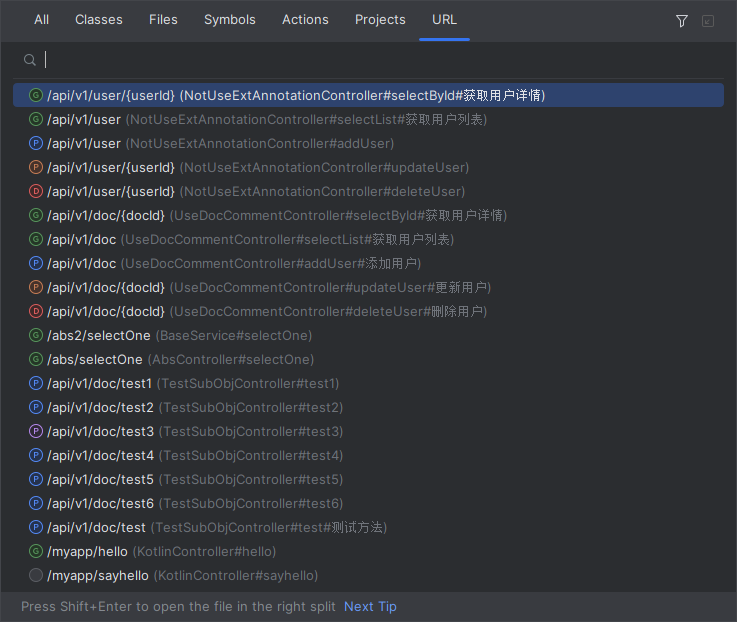
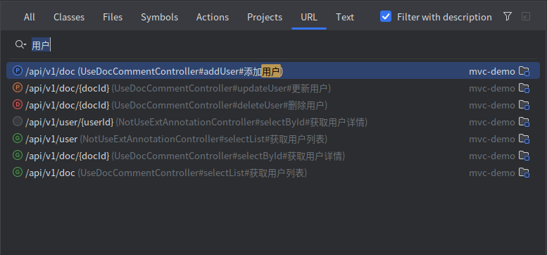
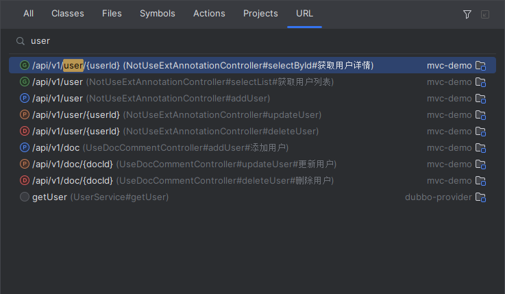

# 搜索URL

目前支持两种搜索方式

## Search Everywhere
打开方式：

- `Double Shift`，找到**URL tab**
- 点击工具栏的 **search icon 🔍** ，快捷键为：`Ctrl \ ` 或 `Ctrl Alt N`

打开后如图：

`3.4.0`开始默认不匹配description部分，需手动勾选匹配

可在设置中设置显示module/分组名称，效果如下图：

在search everywhere中选中具体的URL后，按 `Option` 或 `Alt` 可跳转到service tree中对应的列表项。

## Service tree支持idea自身的输入搜索

当焦点在RestfulBox窗口中，直接输入关键词

