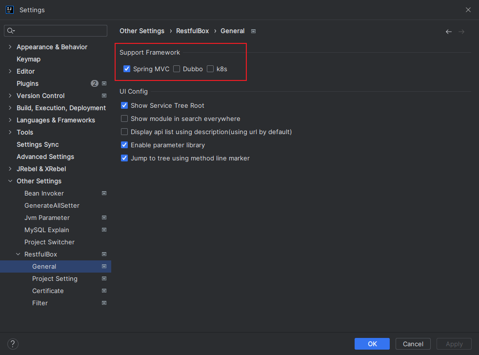
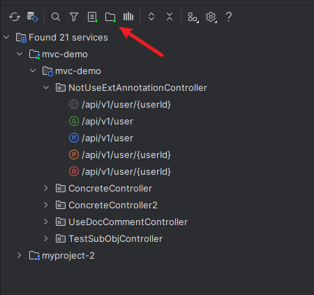
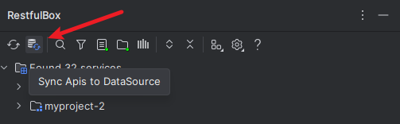
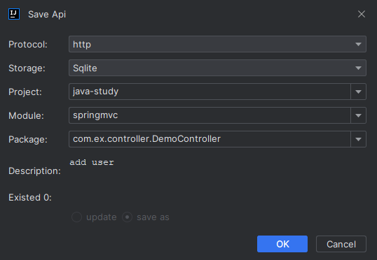
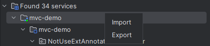

## 概述
API接口可分为多个类型：

- 按协议：http接口、dubbo接口、k8s自定义接口
- 按存储方式;：扫描类、存储类（Sqlite、之前的Local API）

以上两种类型通常结合起来使用，如支持扫描springmvc的http接口。

## 设置
如图显示支持的扫描类型，勾选即启用。存储类不展示，默认启用。

## 展示
点击toolbar的刷新按钮，将展示多个项目的接口，可点击【过滤2】按钮进行配置。

## 同步API
将接口列表一键同步到指定的数据源。

## 添加和更新

在Request Client的任意编辑器区域右键，点击【Save Api】。已存在api时会提示。操作完成后执行结果将更新到数据源。

- **Protocol**: 支持的协议，默认提供http。可扩展，如dubbo
- **Storage**: 存储API的方式（目的地）。可扩展，对应存储类型
- **Project**：项目名，所属项目
- **Module**: 模块名，属模块级别的分组
- **Package**：包名，属包级别的分组
- **Description**: 描述，建议简短明了。当树节点名称设置为显示描述时，即使用此字段。
- **Existed**: 是否已存在，根据 method+url 一起判断

## 删除

可删除存储类型的接口，不支持删除扫描类型的接口。在列表api上右键，删除。操作完成后执行结果将更新到数据源。

## 导入/导出

- 导出: 可导出**所有/按项目/按模块/按包名/多选/单个**，分别对应不同树节点右键菜单
- 导入: 在树根结点/项目节点右键菜单导入。操作完成后执行结果将更新到数据源。

