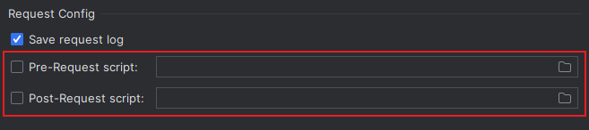
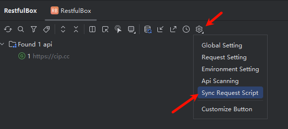

# 请求脚本

## 概述

在发送请求前后，可通过脚本对请求的前后内容进行操作，如替换token、加密请求等。


## 请求执行过程


## 设置脚本路径

`RestfulBox Setting` > `Project Setting` > `Request` >` Request Config`



## 前置脚本

-  默认生成的前置脚本位于：`$PROJECT_DIR$/.idea/restkit/Pre-request Script.js` 
-  使用说明： 

```javascript
// You can use custom preset object request and environment, attributes are:
//
// request attributes
// url:         java.lang.String,               request url, can be modified by pre-request script.
// method:      java.lang.String,               request method, can be modified by pre-request script.
// config:      java.util.Map<String, String>,  request config, can be modified by pre-request script.
// headers:     java.util.Map<String, String>,  request headers, can be modified by pre-request script.
// params:      java.util.Map<String, String>,  request params, can be modified by pre-request script.
// body:        java.lang.String,               request body, can be modified by pre-request script.
//
// environment: java.util.Map<String, String>,  current environment, defined in the Environment setting, readonly.
//
// See more usages in nashorn-users-guide: https://docs.oracle.com/en/java/javase/12/nashorn/nashorn-users-guide.pdf
```

- 示例：

```javascript
var env = environment;
var baseUrl = env.baseUrl;
var username = env['username'];

var req = request;
var url = req.url;
var method = req.method;
var headers = req.headers;
var params = req.params;
var body = req.body;

req.url = 'http://httpbin.org/ip';
req.method = 'GET';
req.headers = {
    'x-auth-ts': '' + new Date().valueOf(),
    'x-auth-traceid': '83b557cc-366a-4274-8912-078e71216c51',
};
req.headers['x-auth-token'] = '70309f2cc6a6462497f824e77baa77f9';
req.params = { code: 'ABCD' };
req.params.name = 'JavaNashorn';
req.body = JSON.stringify({ reqBody: 'Hello world!' });
```

## 后置脚本

-  默认生成的后置脚本位于：`$PROJECT_DIR$/.idea/restkit/Post-request Script.js` 
-  使用说明： 

```javascript
// You can use custom preset object request、response and environment, attributes are:
//
// request: see pre-request script comment
//
// response attributes
// original:    org.apache.http.HttpResponse,   original http response, from http-client 4.4.
// body:        java.lang.String,               response body can be modified by post-request script.
//
// environment: java.util.Map<String, String>,  current environment, defined in the Environment setting, readonly.
//
// See more usages in nashorn-users-guide: https://docs.oracle.com/en/java/javase/12/nashorn/nashorn-users-guide.pdf
```

- 示例：

```javascript
var env = environment;
var baseUrl = env.baseUrl;
var username = env['username'];

var req = request;
var resp = response;
var statusCode = resp.original.getStatusLine().getStatusCode();

if (statusCode != 200) {
    resp.body = JSON.stringify({ error: 'error occurred!' });
} else {
    resp.body = JSON.parse(resp.body).origin;
}
```

## 同步脚本

由于请求脚本的载体为文件，数据源中保存了脚本存储路径，更新脚本时不会自动同步内容到数据源。当使用到了请求脚本，是否同步需分以下两种情况考虑：

1、如果是单机/本地开发，当选择的数据源为本地方式，如现有的IDE和Sqlite，且没有通过其他方式同步相应的数据文件，就不需要同步脚本。

2、如果是跨机器开发，选择了MySQL等数据源或是将Sqlite文件通过网盘等方式进行同步，则需将请求脚本一并进行同步。此种情况下需手动同步脚本，本地上传到云端、云端下载到本地。

操作入口：



本地上传到云端：
根据脚本文件位置，将本地设置过的脚本上传到云端，云端存在时会被覆盖。


云端下载到本地：
根据配置中存在脚本内容，将本地脚本文件内容更新，不存在时则创建文件，本地存在时会被覆盖。


## js脚本使用语法

参考文档：[https://mouse0w0.github.io/2018/12/02/Introduction-to-Nashorn](https://mouse0w0.github.io/2018/12/02/Introduction-to-Nashorn)
