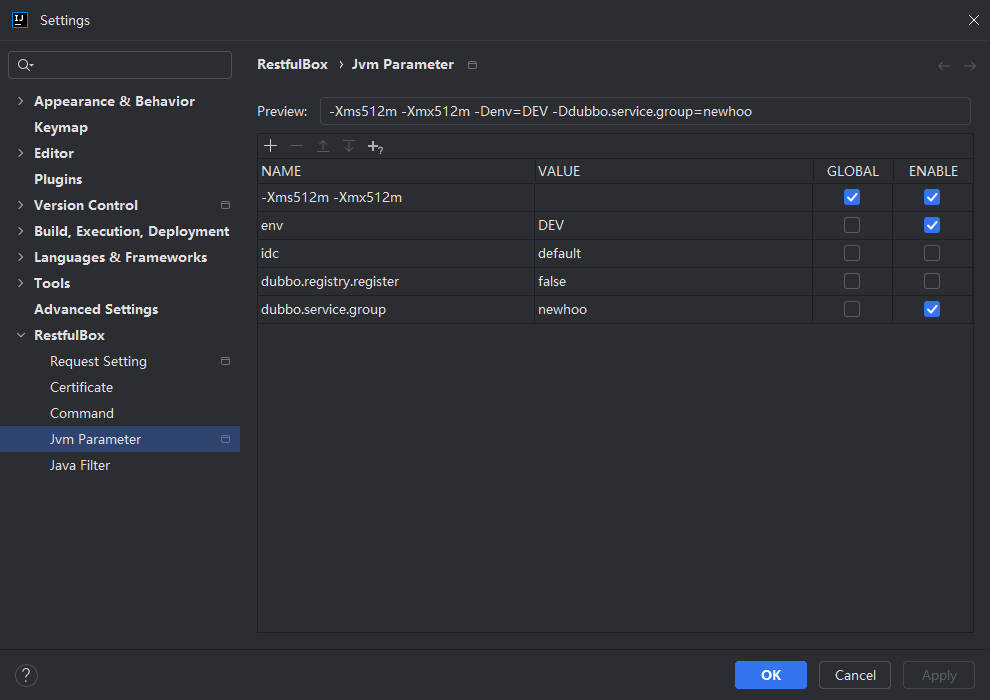

# 运行参数管理

## 概述

方便管理运行参数（包括Jvm），启动应用时，启用的环境变量和jvm参数将被自动设置到应用中。

## 功能

- 项目级参数管理
- 全局(跨项目)参数管理

## 配置

在设置中添加启动参数。

- 预览：预览启用的参数（鼠标Hover时可换行查看）
- 参数表格说明

| 列名     | 描述                              |
|--------|---------------------------------|
| NAME   | 参数key，不可为空                      |
| VALUE  | 参数value。为空时，生成的内容为NAME内容（jvm参数） |
| ENABLE | 是否启用                            |
| GLOBAL | 是否为全局参数                         |

## 其他

- 运行时环境变量支持Golang和Java
- Jvm启动参数依赖Java插件，如IDEA/Android Studio