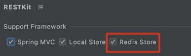
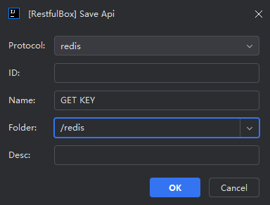
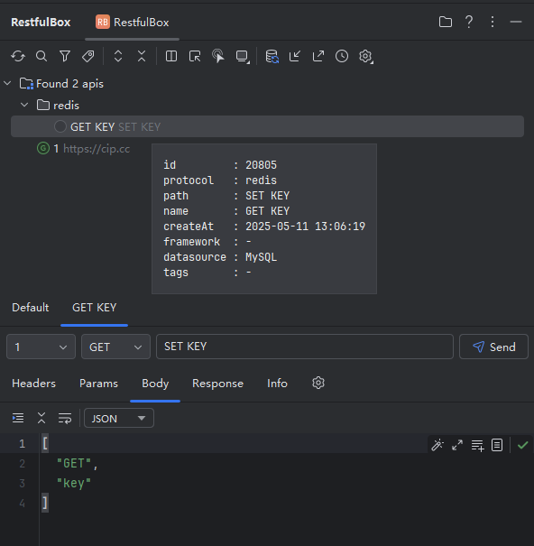

# RESTKit-JAX-RS插件

**RESTKit-Redis** 是[RESTKit](https://plugins.jetbrains.com/plugin/14723-restfulbox) 的辅助插件，用于通过`RestfulBox`提供Redis支持，支持存储API到redis和简单的redis命令发送。

[GitHub](https://github.com/newhoo/RESTKit-Redis)｜[Jetbrains](https://plugins.jetbrains.com/plugin/18869-restkit-redis)

## 安装

- **插件市场安装**

推荐  _Preferences(Settings)_ > _Plugins_ > _Browse repositories..._ > _输入"RESTKit-Redis"_ > _点击Install_

- **本地安装**

在GitHub仓库中选择`distributions/RESTKit-Redis-x.x.x.zip`下载进行本地安装。

操作：_Preferences(Settings)_ > _Plugins_ > _Install Plugin from Disk..._

## 功能

- 支持RESTKit的绝大多数功能。
- 支持保存接口到Redis。
- 支持发送redis命令。

## 使用

安装完成后，在`RESTKit`插件设置中启用，填写相关配置。

配置redis服务器地址和项目名称，用于存储API。若发送redis命令时未指定redis地址，会使用此地址。

### 保存api到redis

### 保存redis命令

### 发送redis命令

UI说明：

- Config：请求配置，redis请求的一些配置，可使用环境变量。支持以下配置： 
   - address：redis地址，默认`{{redisAddress}}`，如没有配置环境变量，则请求时替换为配置中的redis服务器地址。
- Headers：在redis请求中没用到，请忽略
- Params：在redis请求中没用到，请忽略
- Body：redis命令内容，字符串数组格式
- Response：响应内容
- Info：一次请求响应的内容
