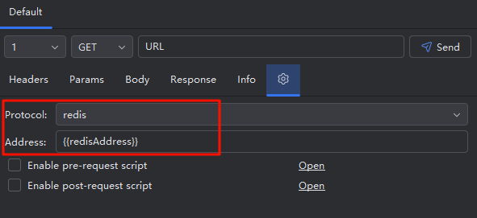

# RESTKit-JAX-RS插件

**RestfulBox-Redis** 是[RestfulBox](https://plugins.jetbrains.com/plugin/14723-restfulbox) 的辅助插件，用于通过`RestfulBox`提供Redis支持，支持存储API到redis和简单的redis命令发送。

[GitHub](https://github.com/newhoo/RestfulBox-Redis)｜[Jetbrains](https://plugins.jetbrains.com/plugin/18869-restfulbox-redis)

## 安装

- **插件市场安装**

推荐  _Preferences(Settings)_ > _Plugins_ > _Browse repositories..._ > _输入"RestfulBox-Redis"_ > _点击Install_

## 功能

- 支持 RestfulBox 的绝大多数功能。
- 支持发送简单的 redis 命令。

## 使用

### 保存redis命令

### 发送redis命令

先设置 redisAddress

UI说明：

- Config：请求配置，redis请求的一些配置，可使用环境变量。支持以下配置： 
   - address：redis地址，默认`{{redisAddress}}`，如没有配置环境变量，则请求时替换为配置中的redis服务器地址。
- Headers：在redis请求中没用到，请忽略
- Params：在redis请求中没用到，请忽略
- Body：redis命令内容，字符串数组格式
- Response：响应内容
- Info：一次请求响应的内容
