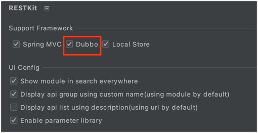
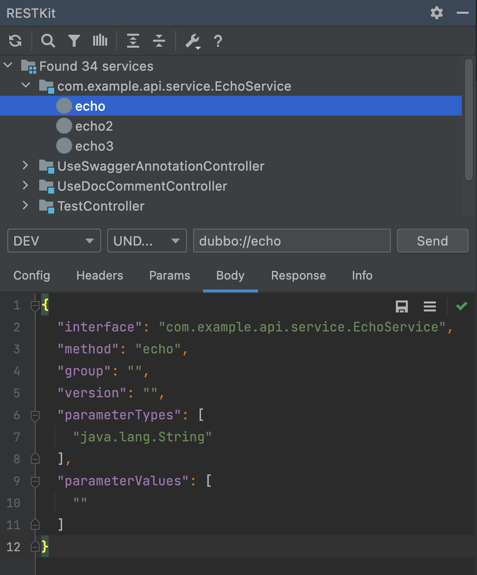

# RestfulBox-Dubbo插件

**RestfulBox-Dubbo** 是 [RestfulBox](https://plugins.jetbrains.com/plugin/14723-restfulbox) 的辅助插件，用于通过`RestfulBox`提供Dubbo接口的支持，支持dubbo服务扫描和发送请求。

[GitHub](https://github.com/newhoo/RESTKit-Dubbo)｜[Jetbrains](https://plugins.jetbrains.com/plugin/18828-restkit-dubbo)

## 安装

- **插件市场安装**

推荐  _Preferences(Settings)_ > _Plugins_ > _Browse repositories..._ > _输入"RestfulBox-Dubbo"_ > _点击Install_

## 功能

- 支持RestfulBox的绝大多数功能。
- 支持扫描Java项目中的dubbo服务。
- 支持发送dubbo请求。
- 支持在dubbo服务实现方法上跳转到service tree窗口。

## 使用

安装完成后，在 `RestfulBox`插件设置中启用，然后在 `RestfulBox`窗口刷新项目接口。

如下图：

UI说明：

- Config：请求配置，dubbo请求的一些配置，可使用环境变量。支持以下配置： 
   - registry：注册中心，只支持zookeeper，默认 `{{registry}}`，如没有配置环境变量，则请求时替换为 `zookeeper://127.0.0.1:2181`
   - url：dubbo直连url，如 `dubbo://127.0.0.1:20880`。默认 `{{url}}`，如没有配置环境变量，则请求时替换为空
   - timeout：request timeout，默认2000ms。若没有此字段，则默认timeout为5000ms
   - applicationName：如无配置，默认为RESTKit-Dubbo-proxy
   - retries：如无配置，默认0
   - check：如无配置，默认false
   - loadbalance：如无配置，默认为空
- Headers：dubbo请求的attachments
- Params：在dubbo请求中没用到，请忽略
- Body：dubbo泛化调用的一些内容，不能引用环境变量
- Response：响应内容
- Info：一次请求响应的内容
